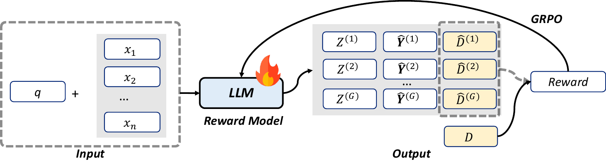

# Inducing Process Supervision from Outcome-Only Reinforcement Learning


This repository contains a runnable release of **TIPS** (**T**hinking-**I**nduced **P**rocess **S**upervision), an outcome-only reinforcement learning framework for inducing process reward model (PRM) behavior from generative reward models.

[](figs/TIPS2.pdf)

*Overview of TIPS.*

## What We Do

TIPS turns outcome supervision into step-level process verification without human or Monte Carlo step labels. It trains a generative reward model to reason over a trajectory and predict both step-level and outcome labels, while rewarding only outcome correctness. This outcome-only signal selects reasoning patterns that accurately verify intermediate steps, producing a process reward model with substantially cheaper supervision.

The release covers two domains:

- **Math reward modeling**: convert math/process datasets into `verl` RL parquet format and train/evaluate a generative reward model.
- **Agent reward modeling**: convert agent trajectories into outcome-supervised RL data and evaluate first-error localization.

## Released Artifacts

- [TIPS Training Data](https://huggingface.co/datasets/XingYing-stack/TIPS-Training-Data)
- [TIPS-Qwen3-4B-Instruct-2507-Math](https://huggingface.co/XingYing-stack/TIPS-Qwen3-4B-Instruct-2507-Math)
- [TIPS-Qwen3-4B-Thinking-2507-Math](https://huggingface.co/XingYing-stack/TIPS-Qwen3-4B-Thinking-2507-Math)
- [TIPS-Qwen3-4B-Instruct-2507-Agent](https://huggingface.co/XingYing-stack/TIPS-Qwen3-4B-Instruct-2507-Agent)
- [TIPS-Qwen3-4B-Thinking-2507-Agent](https://huggingface.co/XingYing-stack/TIPS-Qwen3-4B-Thinking-2507-Agent)

## Main Results

The full paper evaluates TIPS on mathematical reasoning and agent tasks across Qwen, LLaMA, DeepSeek-distilled, and SmolLM backbones. This repository contains the minimal runnable code path and tiny examples; the released training data and checkpoints are hosted on Hugging Face above.

### Math Best-of-8 Reranking

With Qwen2.5-7B-Instruct as the policy model, TIPS improves generative PRM reranking using only 3.2K outcome-labeled trajectories.

| Model | Supervision | Avg. Best-of-8 |
| --- | --- | ---: |
| Majority Vote@8 | N/A | 67.8 |
| Pass@8 | Oracle | 78.1 |
| Qwen3-4B-Instruct-2507 | Prompt-only | 71.6 |
| Qwen3-4B-Thinking-2507 | Prompt-only | 72.8 |
| SCAN-PRM-Qwen3-4B-Instruct-2507 (197K) | MC | 69.2 |
| ImplicitPRM-Qwen3-4B-Instruct-2507 (197K) | Outcome | 68.8 |
| TIPS-Qwen3-4B-Instruct-2507 (3.2K) | Outcome | 72.8 |
| TIPS-Qwen3-4B-Thinking-2507 (3.2K) | Outcome | 73.3 |

### ProcessBench Error Localization

On ProcessBench, TIPS turns outcome-only supervision into strong step-level verification.

| Model | Supervision | Avg. F1 |
| --- | --- | ---: |
| GPT-5.4-Instruct | Prompt-only | 79.4 |
| Claude-4.7-Opus | Prompt-only | 79.3 |
| o1-mini | Prompt-only | 87.9 |
| Qwen2.5-Math-PRM-72B | MC+Distill | 78.3 |
| GenPRM-32B | MC+Distill | 77.6 |
| AutoPSV-Qwen3-4B-Instruct-2507 (197K) | Outcome | 45.3 |
| ImplicitPRM-Qwen3-4B-Instruct-2507 (197K) | Outcome | 41.5 |
| TIPS-Qwen3-4B-Instruct-2507 (3.2K) | Outcome | 77.7 |
| TIPS-Qwen3-4B-Thinking-2507 (3.2K) | Outcome | 85.2 |

### AgentProcessBench First-Error Accuracy

TIPS also improves first-error localization on agent trajectories, though the transfer is weaker than in math because final task success is less directly determined by any single local step.

| Model | Base Avg. | TIPS Avg. | Gain |
| --- | ---: | ---: | ---: |
| Qwen3-4B-Instruct-2507 | 42.5 | 45.0 | +2.5 |
| Qwen3-4B-Thinking-2507 | 43.7 | 49.1 | +5.4 |
| Qwen3-8B-Thinking | 41.5 | 46.0 | +4.5 |

## Repository Layout

```text
verl/                         # Full runtime required by python -m verl.trainer.main_ppo
PRM_from_ORM/
  prepare_math_process_judge_data.py
  prepare_agent_process_judge_data.py
  eval_math_process_judge.py
  run_math_process_judge_grpo.sh
  run_agent_process_judge_grpo.sh
  templates/
    math_process_judge_prompt.txt
    agent_process_judge_system_prompt.txt
    agent_process_judge_user_prompt.txt
  examples/
    math_tiny/
    agent_tiny/
tests/PRM_from_ORM/            # CPU-only sanity tests for the exported path
```

## Quick Start

Install the local package and test dependencies:

```bash
pip install -e .[test]
```

Run CPU-only sanity checks:

```bash
pytest -q tests/PRM_from_ORM
```

Expected success signal: all tests pass. In the exported environment this was verified with `13 passed`.

## Prepare Tiny Examples

Prepare the tiny math fixture:

```bash
python PRM_from_ORM/prepare_math_process_judge_data.py \
  --output_dir /tmp/tips_math_process_judge \
  --dev_ratio 0.0
```

Expected outputs:

- `/tmp/tips_math_process_judge/scan_pro_train.parquet`
- `/tmp/tips_math_process_judge/processbench_eval.parquet`

Prepare the tiny agent fixture:

```bash
python PRM_from_ORM/prepare_agent_process_judge_data.py \
  --output_dir /tmp/tips_agent_process_judge
```

Expected outputs:

- `/tmp/tips_agent_process_judge/agent_train_orm.parquet`
- `/tmp/tips_agent_process_judge/agentprocessbench_bfcl_eval.parquet`
- `/tmp/tips_agent_process_judge/agentprocessbench_eval_manifest.json`

Agent prompt templates live under `PRM_from_ORM/templates/` and can be overridden with `--system_template_path` and `--user_template_path`.

## GRPO Training Launch

Training requires the normal `verl` GPU stack, a model, and generated parquet files. The launch scripts are intentionally kept in this release and parameterized through environment variables. They fail fast if `MODEL_PATH` or `TRAIN_FILES` is missing.

Math launch shape:

```bash
MODEL_PATH=/path/to/model \
DATA_DIR=/tmp/tips_math_process_judge \
OUTPUT_DIR=/tmp/tips_math_ckpts \
LOGGER='["console"]' \
bash PRM_from_ORM/run_math_process_judge_grpo.sh
```

Agent launch shape:

```bash
MODEL_PATH=/path/to/model \
DATA_DIR=/tmp/tips_agent_process_judge \
OUTPUT_DIR=/tmp/tips_agent_ckpts \
LOGGER='["console"]' \
bash PRM_from_ORM/run_agent_process_judge_grpo.sh
```

For smoke-test style validation-only runs, append `trainer.val_only=True trainer.val_before_train=True`.

## Acknowledgements

This project is built upon [verl](https://github.com/volcengine/verl). We sincerely thank the verl team and community for their great work! We also thank the teams behind [ProcessBench](https://github.com/QwenLM/ProcessBench), [AgentProcessBench](https://github.com/RUCBM/AgentProcessBench), and [SCAN](https://scan-prm.github.io/) for making their work and resources available.

## License

This project is licensed under [Apache-2.0](LICENSE). Upstream verl attribution is included in [NOTICE](NOTICE).
